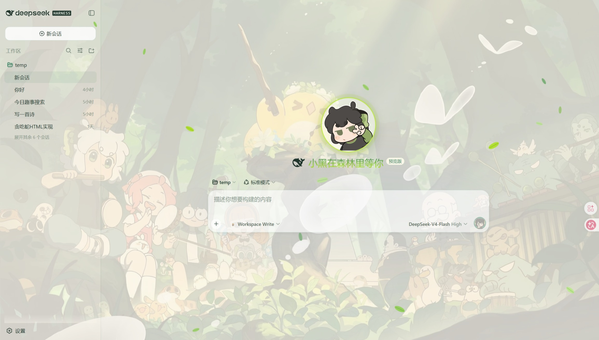
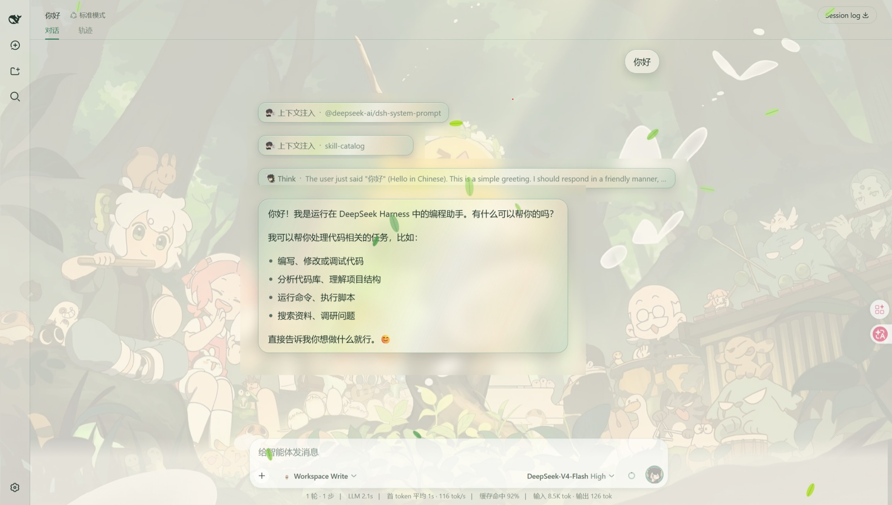
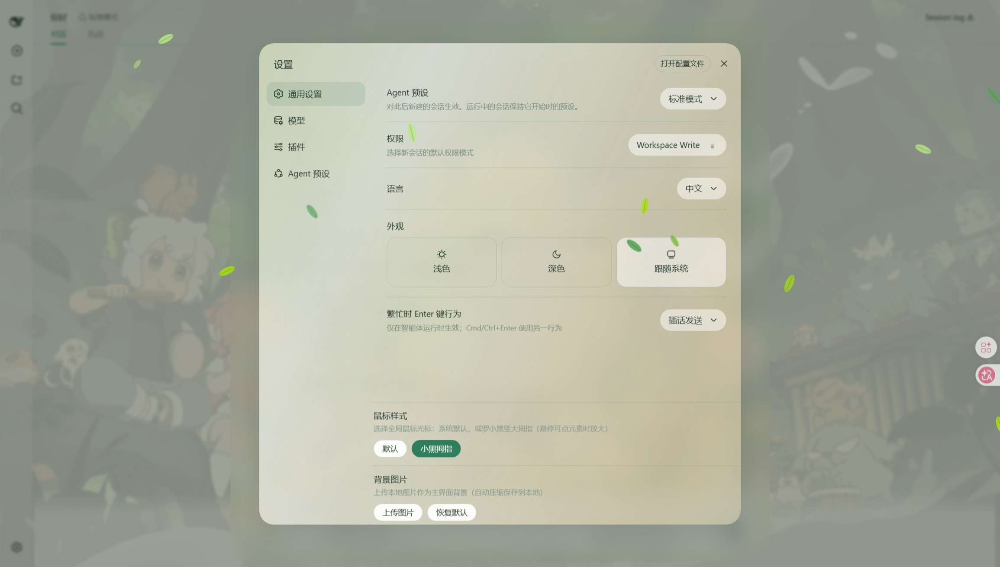

# 小黑森林 · DeepSeek Harness 主题

给 DeepSeek Harness 换上罗小黑主题。浅色「奶油森林」与深色「深夜森林」双主题，跟随系统深浅自动切换，让工作界面焕然一新。

## 效果

### 主界面



### 对话界面



### 设置面板



## 功能

- 浅色「奶油森林」/ 深色「深夜森林」双主题，跟随系统自动切换
- 森林插画背景 + 飘落叶片动效
- 透明玻璃气泡：AI 回答与工具调用都有干净的玻璃框
- 自定义背景：设置面板上传本地图片，替换默认背景
- 鼠标样式可切换：系统默认 / 小黑拇指
- 停用皮肤即完全还原，不影响其他功能

## 安装

一键安装（交给 AI 助手或任意终端）：

```sh
dsh plugin --profile web add https://github.com/haohaozi328-arch/dsh-skin-luoxiaohei.git
```

手动安装：

```sh
git clone https://github.com/haohaozi328-arch/dsh-skin-luoxiaohei.git
cd dsh-skin-luoxiaohei
dsh plugin --profile web add .
```

安装后重启 `dsh web`，刷新页面即可生效。

## 卸载

```sh
dsh plugin --profile web remove dsh-skin-luoxiaohei
```

## 使用

- 左下角「设置」：切换外观（浅色 / 深色 / 跟随系统）、鼠标样式
- 设置里的「背景图片」：上传自己的图片作为主界面背景
